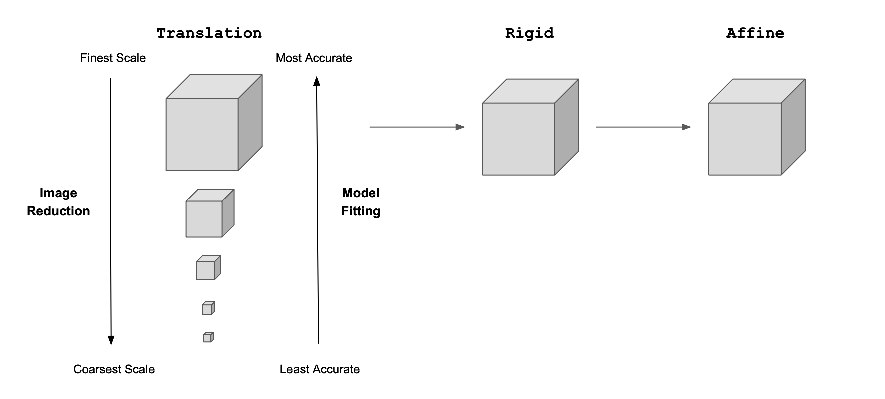
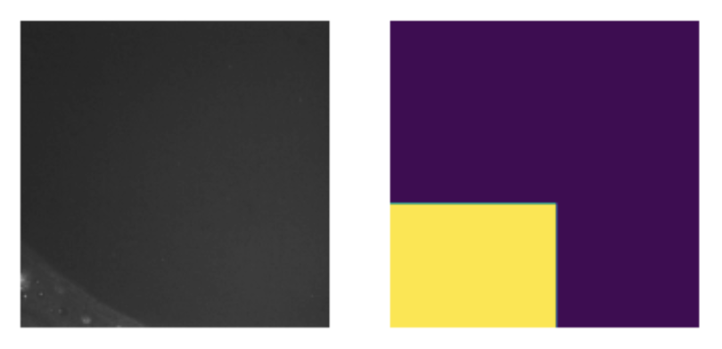

## Align Module 

### Overview
The align module is used for image alignment (registration). During registration, we find a mathematical model that when applied to images from later rounds of staining, will align them with the images from the first. The transformation may include translation, rotation, scaling, or more complex transformations such as affine or perspective transformations. The chosen alignment method implemented in this module is a multiscale framework. This means that each volume pair goes through a series of downsampling steps, blurring steps, and registration steps. Specifically, we have the following registration protocol: 

1. The image pair is downsampled to one-tenth of the size and a Gaussion blur with a standard deviation of $\frac{1}{10}$ is applied. The Gaussian blur ensures that the registration algorithm is not fitting to noise or artifacts in the data. Intensity-based registration restricted to image translation is performed. Performing this restriction and limiting the search space to translation encourages the algorithm to first fix the large z-offset.
2. The image pair is downsampled to one-eighth of the size and a Gaussion blur with a standard deviation of $\frac{1}{8}$ is applied. Again, intensity-based registration restricted to image translation is performed.
3. The image pair is downsampled to one-fourth of the size and a Gaussion blur with a standard deviation of $\frac{1}{4}$ is applied. Again, registration restricted to image translation is performed. 
4. The image pair is downsampled to one-half of the size and a Gaussion blur with a standard deviation of $\frac{1}{2}$ is applied. Again, registration restricted to image translation is performed.
5. Intensity-based registration restricted to image translation is performed on the full-resolution image.
6. Intensity-based registration restricted to a rigid transformation (translation and rotation) is performed on the full-resolution image.
7. Intensity-based registration restricted to an affine transformation (translation, rotation, scaling and shearing) is performed on the full-resolution image. 

  
  

  <em>Multi-resolution registration protocol</em>

### Masking
In some cases, this multiscale-framework fails. Thus, we adopted image masking. We often add this step when content is sparse (i.e. the volume is close to empty). With image masking, we limit the registration to specific regions of interest (ROIs). This is useful when we only care about certain features or structures, and want to optimize registration for those areas. To make the masks compatible with our registration sampling procedure (i.e. to make sure we have enough content to sample from), we take the inner-most slice of the volume, identify objects using Meta's Segment Anything Model, then create a bounding box around them. This bounding box is then filled with ones and the image is repeated along the z-axis to match the shape of the origin volume.

  
  

  <em> Low staining intensity and little content cause issues  with
registration. A mask (right) is added to the image (left) to limit search space.
</em>

### Other Failures
There are usually one to two volume pairs per experiment that even with masking and the multi-level framework, fail to register correctly. We've found that this is often due to a dramatic loss of staining intensity coupled with the volume pair being from a field of view that is along the edge of the imaged structure. In these cases, we perform the same protocol as above, but remove any empty slices at the beginning and end of the volumes. The masking function can also take in 'start' and 'end' positions as parameters, which fills all slices before 'start' and after 'end' with zeros. This is equivalent to cropping.
